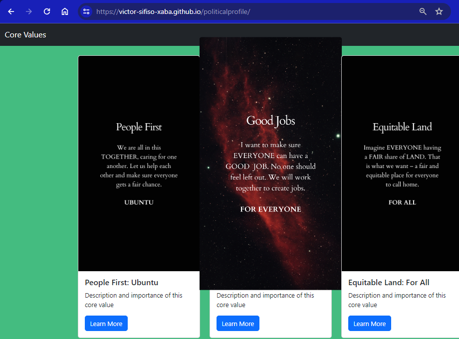

# Political Profile Core Values

## Description:
Core Values or political core values are the core values of a political candidate. The website offers 10 selections of the core values of the political candidate. The creative designer for the 10 core values designs is Victor Sifiso Xaba.

## Table of Contents:
- [Installation](#installation)
- [Usage](#usage)
- [Screenshots](#screenshots)
- [Credits](#credits)
- [GitHub Repository](#github-repository)

## Installation:
To view the Core Values locally, follow these steps:
1. Clone the repository: `git clone https://github.com/victor-sifiso-xaba/politicalprofile.git`
2. Open the `index.html` file in a web browser.

## Usage:
1. Visit the [Core Values](https://victor-sifiso-xaba.github.io/politicalprofile/) website.
2. Browse through the collection of 10 core values.
3. Browse on any value to see a zoom of the core value.
4. Click the "Learn More" button to find out the description of the core value.

## Screenshots:

## Credits:
- Developed by [iMuhluri](https://www.linkedin.com/in/victor-sifiso-xaba)
- Core values designs by [Victor Sifiso Xaba](https://www.linkedin.com/in/victor-sifiso-xaba)

## GitHub Repository:
[Core Values Repository](https://github.com/victor-sifiso-xaba/politicalprofile)
